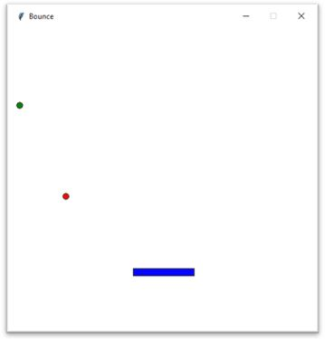

# Bounce Ball Game
The goal of this game is to keep the balls in the ar.

## Level of Difficult
You can choose as many balls as you want. Just create a new ball class

## Actions
- `Keyboard arrow to the left`
- `Keyboard arrow to the right`

## Installation
- pip install tkinter 

## Future Implementation
- add score to the game
- create the main Menu
- use Deep Reinforcement Learning to play the game

